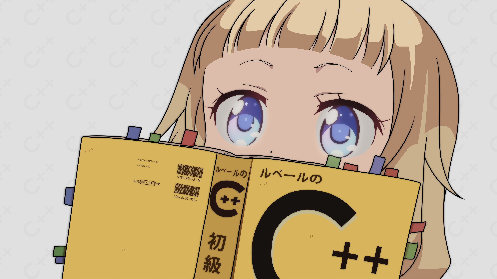

<p align="center">
  
</p>

<h1 align="center">Hey, I'm poupou 👋</h1>

<p align="center">
  <b>16 y/o • Certified Slop Creator</b>
</p>

<p align="center">
  
  
  
  
</p>

---

### 🫠 Who am I?

- 👦 Just a normal **16-year-old guy**.
- 📉 **Terrible at coding** literally everything. If it can break, I will break it.
- 🗑️ Proud producer of **AI slop** and handcrafted **me-slop**.
- 🦥 **Very dumb, completely un-advanced, and aggressively lazy.**

---

### 💻 Technologies

I *technically* know a few languages, but let's be honest:

| Language | How I feel about it |
| :--- | :--- |
| **C++** 💙 | **the only coding language i want to use for everything** |
| **Python** 🐍 | I know it, but so sloooowwwww |
| **HTML5** 🌐 | It's there. I guess. |
| **CSS3** 🎨 | can use it but will be awfully ugly |
| **Rust** 🦀 | absolut hate. stop telling me that rust better i think not and i dont care |

<br>

<p align="center">
  
</p>

<p align="center">
  <i>(Notice how C++ is bigger? Because nothing else is BETTER. dont care about rust)</i>
</p>

---

### 🧠 Typical Day in My Life

```cpp
#include <iostream>

int main() {
    bool is_lazy = true;

    // The loop never runs because is_lazy is already true
    while (!is_lazy) {
        std::cout << "Writing low-tier C++ and generating slop...\n";
        // TODO: Fix later (I will never fix this)
    }

    std::cout << "Too lazy to do anything. Going back to sleep.\n";
    return 0; // Segmentation fault (core dumped)
}
```
